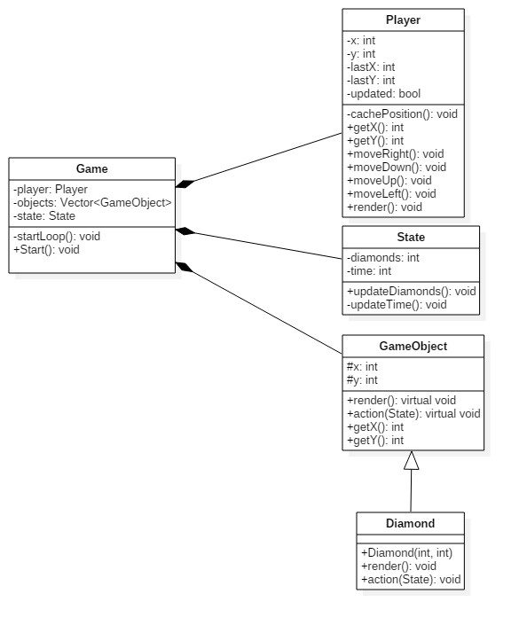

Sprawozdanie 2

# Boulder Dash

## Wstęp

  Pracę nad projektem zostały rozpoczęte. Poniżej zostaną przedstawione dotychczasowe efekty pracy. Zaimplementowane zostały następujące klasy:

## Projekt klas



## Opis funkcji

- `Game::start()` : funkcja uruchamiająca grę.
  W przyszłości zostanie podzielona na rózne dopowiedzialności, obecnie tworzy mapę startową, odpowiada za alokacje pamięci na potrzeby obiektów `GameObject`, `Player` i `State` oraz uruchamia główną pętle `Game::startLoop()`.

```c++
void Game::start()
{
  char map[MAP_X][MAP_Y];

  for (int x = 0; x < MAP_X; x++)
  {
    for (int y = 0; y < MAP_Y; y++)
    {
      map[x][y] = '#';
    }
  }

  map[1][1] = '@';
  map[3][2] = 'D';
  map[5][4] = 'D';
  map[9][4] = 'D';

  for (int x = 0; x < MAP_X; x++)
  {
    for (int y = 0; y < MAP_Y; y++)
    {
      if (map[x][y] == '#') {
        setCursor(x, y + offsetY);
        std::cout << "#";
      }

      if (map[x][y] == '@') {
        player = new Player(x, y + offsetY);
      }

      if (map[x][y] == 'D') {
        objects.push_back(std::make_shared<Diamond>(x, y + offsetY));
      }
    }
  }

  for (size_t i = 0; i < objects.size(); ++i) {
    objects.at(i)->render();
  }

  state = std::make_unique<State>();

  hideCursor();
  startLoop();
}
```

- `Game::startLoop` : funkcja uruchamiająca główną pętle, przechwytywane są w niej kliknięcia klawiszy oraz porównywane są koordynaty gracza i obiektów aktywnych,
  jeśli się pokrywają wywoływana jest jakaś akcja zmieniająca stan gry.

```c++
void Game::startLoop()
{
  bool active = true;

  while (active)
  {
    if (_kbhit()) {
      switch (_getch())
      {
      case KEY_UP:
        player->moveUp();
        break;
      case KEY_DOWN:
        player->moveDown();
        break;
      case KEY_LEFT:
        player->moveLeft();
        break;
      case KEY_RIGHT:
        player->moveRight();
        break;
      case ESC:
        active = false;
        break;
      default:
        break;
      }
    }


    for (size_t i = 0; i < objects.size(); ++i) {
      bool testX = player->getX() == objects.at(i)->getX();
      bool testY = player->getY() == objects.at(i)->getY();

      if (testX && testY) {
        objects.at(i)->action(state);
        objects.erase(objects.begin() + i);
      }
    }

    player->render();

    Sleep(1);
  }
}
```

- `Player::render()` : odpowiada za umieszczenie w odpowiednim miejscu na mapie ikony gracza (@). Wykonuje swoje zadanie tylko wtedy gdy obiekt gracza został zaktualizowany.

```c++
void Player::render() {
  if (updated) {
    setCursor(lastX, lastY);
    std::cout << " ";
    setCursor(x, y);
    std::cout << "@";
    updated = false;
  }
}
```

- `GameObject::action()`: funkcja wywolująca określoną akcję (nadpisana w kazdym z obiektów aktywnych)

## Wnioski

- Należy zastanowić się nad lepszą implementacją aktualizacji stanu gry po wykonaniu się zdefiniowanej akcji "obiektu aktywnego" (`GameObject`)

- Funkcja `Game::start()` musi zostać podzielona na funkcje o pojedyńczych odpowiedzialnościach.

- Należy pamiętać o opóźnieniu głownej pętli aby ograniczyć użycie CPU