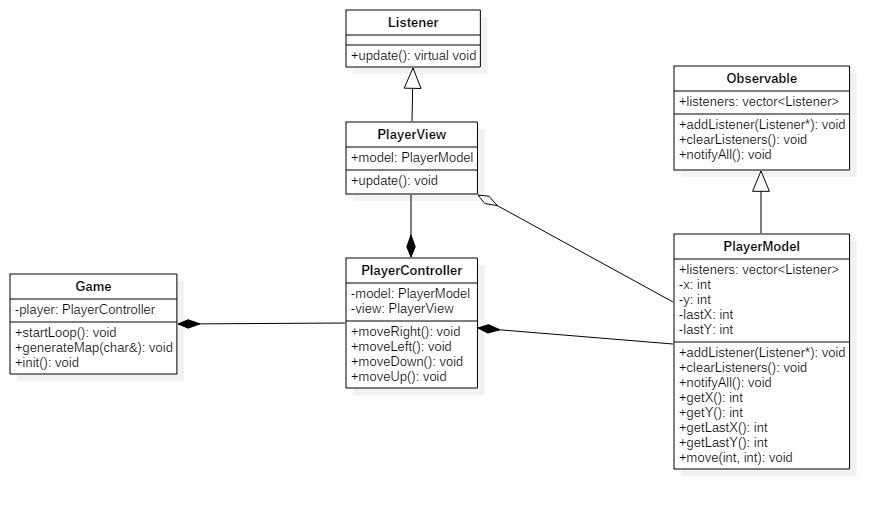

Sprawozdanie 3

# Boulder Dash

## Wstęp

W tym sprawozdaniu zostanie opisana refaktoryzacja kodu w celu wdrożenia wzorca projektowego MVC.
Wzorzec mvc zakłada podział aplikacji na 3 główne części:
  - Model (model) - reprezentuje logikę aplikacji, pozwala na zarządzanie danymi
  - View (widok) - odpowiada za wyświetlenie danych zgromadzonych w modelu
  - Controller (kontroler) - zarządza akcjami wykonywanymi przez użytkownika, wykonuje aktualizację modelu


## Projekt klas

Zaimplementowane klasy:



## Opis

- W celu automatycznej aktualizacji widoku po aktualizacji modelu zastosowany został wzorzec projektowy obserwator. Składa się on z 2 klas `Listener` (obserwator)
  i `Observable` (obiekt obserwowany). Klasa `Listener` jest klasą abstrakcyjną i posiada tylko jedną funkcję  `update()`.

  ```c++
  class Listener
  {
  public:
    Listener() {}
    ~Listener() {}

    virtual void update() = 0;
  };
  ```

  Funkcja ta jest przysłaniana w każdej z klas pochodnych np. widokach.

  ```c++
  void PlayerView::update()
  {
    setCursorP(model->getLastX(), model->getLastY());
    std::cout << " ";

    setCursorP(model->getX(), model->getY());
    std::cout << "@";
  }
  ```

  Natomiast klasa ```Observable``` jest bazową klasą dla obiektów obserwowanych a więc modeli.

  ```c++
  class Observable
  {
  private:
    std::vector <std::shared_ptr<Listener>> listeners;
  public:
    Observable() {}
    ~Observable() {}

    void addListener(std::shared_ptr<Listener> listener) {
      listeners.push_back(listener);
    }

    void clearListeners() {
      listeners.clear();
    }

    void notifyAll() {
      for (auto &listener : listeners) {
        listener->update();
      }
    }
  };
  ```

  ```c++
  class PlayerModel :
    public Observable
  {
    ...
  }
  ```

- Klasa `PlayerController` odpowiada za inicjalizacje modelu i widoku oraz dodania obserwatora (widoku) do modelu.

  ```c++
  PlayerController::PlayerController()
  {
    model = std::make_shared<PlayerModel>(1, 4);
    view = std::make_shared<PlayerView>(model);

    model->addListener(view);
  }
  ```

  Poza tym wykonuje akcje sterowania graczem.

  ```c++
  void PlayerController::moveRigth()
  {
    int x = model->getX();
    int y = model->getY();

    model->changePosition(++x, y);
  }
  ```

- Klasa `Game` zarządza całą rozrywką. Inicjalizuje gracza i tworzy mapę.

  ```c++
  void Game::init()
  {
    player = std::make_unique<PlayerController>();
    char map[MAP_Y][MAP_X];

    hideCursor();
    generateInitialMap(map);
    generateMap(map);
    startLoop();
  }
  ```

## Wnioski
- Wdrożenie wzorca MVC do istniejącego projektu może okazać się trudne jednak w wielu przypadkach może przynieść korzyści.
  MVC poprawia czytelność kodu i jego skalowalność jednak kosztem większej ilości zależności do dołączenia.
  Poza tym pozwala na pisanie testowalnego kodu.